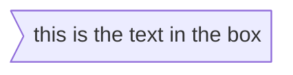

# #Flowchart

---
## #node

### node with text
"id\[This is a text]"

---
## Flowchart Orientation
Possible FlowChart orientations are:
abrev|meaning
:---:|:---:
TB| top to bottom
TD| top-down/ same as top to bottom
BT| bottom to top
RL| right to left
LR| left to right
  
---
  ## #NodeShapes
### A  node with round edges
`id1(This is the text)`

### A Stadium-shapednode
`id1([This is the text in the box])`

### A node in a cylindrical shape
`id1[(Database)]`

### A node in the form of a  circle
`id((This is a circle))`

### A node in a asymmetric shape
`id1>This is the text in the box]`
~~`id1<This is the text in the box]`~~
~~`id1[This is the text in the box<`~~
~~`id1[This is the text in the box>`~~

### A node as rhombus

`id{This  is the text}`

### A  hexagen
`id{{hex}}`

### Parallelogram
`id[/This is a Parallelogram/]`
`id[\This is an alt Parallelogram\]`

### Trapezoid
`A[/Trapezoid\]`
`A[\Trapezoid alt/]`

---

## #NodeLink

Length|1|2|3
:---:|:---:|:---:|:---:
Normal|`---`|`----`|`-----`
Normal with arrow|`-->`|`--->`|`---->`
Thick|`===`|`====`|`=====`
Thick with arrow|`==>`|`===>`|`====>`
Dotted|`-.-`|`-..-`|`-...-`
Dotted with arrow|`-.->`|`-..->`|`-...->`


#NodeLinkText 
**take the 2 begining chars  of the link and add there the text  and at the end of the text write all the link**
example:
nodeA -- normal --- nodeB
or
nodeA ---|normal|nodeB
Style|text|link
:---:|:---:|:---:
Normal|`--`|`----`
Normal with arrow|`--`|`-->`
Thick|`==`|`===`
Thick with arrow|`==`|`===>`
Dotted|`-.`|`-.-`
Dotted with arrow|`-.`|`-.->`

---
### #NodeSubgraph
#### #Syntax
subgraph title
	def
end


### #FlowchartSubgraphDirection 
> Inside the subgraph 
> add `direction TB`

##  #Styling 

### #Stylinglinks
> It is possible to style links. For instance, you might want to style a link that is going backwards in the flow. As links have no ids in the same way as nodes, some other way of deciding what style the links should be attached to is required. Instead of ids, the order number of when the link was defined in the graph is used, or use default to apply to all links. In the example below the style defined in the linkStyle statement will belong to the fourth link in the graph:
### #StylingANode 
`style a stroke:#ff3,stroke-width:4px,color:red,fill:#fff;`

#### #Classes
>
>class nodeId1 className;
>class nodeId1,nodeId2 className;
> A:::someclass --> B

# #SequenceDiagram 

## #Syntax 

###  #Participant

### #Actors


#### #Aliases

`participant/actor a as Alice`

---
## #Messages

Type|Description
:---:|:---:
->|Solid line without arrow
-->|Dotted line without arrow
->>|Solid line with arrowhead
-->>|Dotted line with arrowhead
-x|Solid line with a cross at the end
--x|Dotted line with a cross at the end.
-)|Solid line with an open arrow at the end (async)
--)|Dotted line with a open arrow at the end (async)
### #Activations

looks like squares
activate John  alice->>+John
deactivate John alice->>-John
```mermaid
sequenceDiagram
    Alice->>John: Hello John, how are you?
    activate John
    John-->>Alice: Great!
    Alice->>John: Hello John, how are you?
    activate John
    John-->>Alice: Great!
    deactivate John
    deactivate John
```
###  #Notes 
Ex  Note right of John
```mermaid
sequenceDiagram
    participant John
    Note right of John: Text in note
```
spanning  two participants  over
Note  over Alice,John: A typical interaction
```mermaid
sequenceDiagram
    Alice->John: Hello John, how are you?
    Note over Alice,John: A typical interaction
```
### #loops
```mermaid
sequenceDiagram
    Alice->John: Hello John, how are you?
    loop Every minute
        John-->Alice: Great!
    end
```
### #Alt
Alternative path
alt text
else
opt if whithout else
```mermaid
sequenceDiagram
    Alice->>Bob: Hello Bob, how are you?
    alt is sick
        Bob->>Alice: Not so good :(
    else is well
        Bob->>Alice: Feeling fresh like a daisy
    end
    opt Extra response
        Bob->>Alice: Thanks for asking
    end
```
### #Parallel 

par Alice to Bob
	Alice->>Bob: Hello guys!
and Alice to John
	Alice->>John: Hello guys!
end
or 
par
	Alice->>Bob: Hello guys!
and
	Alice->>John: Hello guys!
end
it can be nested
```mermaid
sequenceDiagram
    par
	    Alice->>Bob: Hello guys!
    and
	    Alice->>John: Hello guys!
    end
    Bob-->>Alice: Hi Alice!
    John-->>Alice: Hi Alice!
```
### #CriticalRegiion

critical [Action that must be performed]
... statements ... 
option [Circumstance A] 
	... statements ... 
option [Circumstance B] 
	... statements ... 
end
also  with no option
```mermaid
sequenceDiagram
    critical Establish a connection to the DB
        Service-->DB: connect
    option Network timeout
        Service-->Service: Log error
    option Credentials rejected
        Service-->Service: Log different error
    end
```
```mermaid
sequenceDiagram
    critical Establish a connection to the DB
        Service-->DB: connect
    end
```
### #Break 
break \[something happened] 
	... statements ... 
end
```mermaid
sequenceDiagram
    Consumer-->API: Book something
    API-->BookingService: Start booking process
    break when the booking process fails
        API-->Consumer: show failure
    end
    API-->BillingService: Start billing process
```
### #Styling 

rect rgb(0, 255, 0)
	... content ... 
end
rect rgba (0, 0, 255, .1) 
	... content ...
end
```mermaid
sequenceDiagram
	autonumber
    participant Alice
    participant John

    rect rgb(191, 223, 255)
    note right of Alice: Alice calls John.
    Alice->>+John: Hello John, how are you?
    rect rgb(200, 150, 255)
    Alice->>+John: John, can you hear me?
    John-->>-Alice: Hi Alice, I can hear you!
    end
    John-->>-Alice: I feel great!
    end
    Alice ->>+ John: Did you want to go to the game tonight?
    John -->>- Alice: Yeah! See you there.
```
#### #SequenceNumbers
	autonumber
### #ActorMenus
`link <actor>: <link-label> @ <link-url>`
```mermaid
sequenceDiagram
    participant Alice
    participant John
    link Alice: Dashboard @ https://dashboard.contoso.com/alice
    link Alice: Wiki @ https://wiki.contoso.com/alice
    link John: Dashboard @ https://dashboard.contoso.com/john
    link John: Wiki @ https://wiki.contoso.com/john
    Alice->>John: Hello John, how are you?
    John-->>Alice: Great!
    Alice-)John: See you later!
```
`links <actor>: <json-formatted link-name link-url pairs>`
```mermaid
sequenceDiagram
    participant Alice
    participant John
    links Alice: {"Dashboard": "https://dashboard.contoso.com/alice", "Wiki": "https://wiki.contoso.com/alice"}
    links John: {"Dashboard": "https://dashboard.contoso.com/john", "Wiki": "https://wiki.contoso.com/john"}
    Alice->>John: Hello John, how are you?
    John-->>Alice: Great!
    Alice-)John: See you later!
```
---
# #classdiagram 
#class
```mermaid
classDiagram
    Animal <|-- Duck
    Animal <|-- Fish
    Animal <|-- Zebra
    Animal: int age
    Animal: String gender
    Animal: isMammal()
    Animal: mate()
    class Duck{
        String beakColor
        swim()
        quack()
    }
    class Fish{
        int sizeInFeet
        canEat()
    }
    class Zebra{
        bool is_wild
        run()
    }
```
#defineClass
Class define
```mermaid
classDiagram
    class BankAccount
    BankAccount : +String owner
    BankAccount : +Bigdecimal balance
    BankAccount : +deposit(amount)
    BankAccount : +withdrawal(amount)
```
 #DefiningMembers 
 ```mermaid
 classDiagram
class BankAccount
BankAccount : +String owner
BankAccount : +BigDecimal balance
BankAccount : +deposit(amount)
BankAccount : +withdrawal(amount)
```
```mermaid
classDiagram
class BankAccount{
    +String owner
    +BigDecimal balance
    +deposit(amount)
    +withdrawal(amount)
}
```
#Return_Type
```mermaid
classDiagram
class BankAccount{
    +String owner
    +BigDecimal balance
    +deposit(amount) bool
    +withdrawal(amount) int
}
```
#Generic_Types
```mermaid
classDiagram
class Square~Shape~{
    int id
    List~int~ position
    setPoints(List~int~ points)
    getPoints() List~int~
}

Square : -List~string~ messages
Square : +setMessages(List~string~ messages)
Square : +getMessages() List~string~
```
#Visibility
simbol|meaning
:----:|:----:
\+|Public
\-| Private
\#|Protected
\~|Package/Internal
\*| Abstract e.g.: someAbstractMethod
`$` |Static e.g.: `someStaticMethod()$`
>[!note]-
>String someField`$`

#DefinitionRelationship
| Type | Description |
| ---- |------------- | 
| <\| | Inheritance |
| \*-- |Composition|
| o-- |Aggregation|
| --> |Association|
| -- |Link (Solid)|
| ..> |Dependency|
| ..\|> | Realization
| .. |Link (Dashed)|
#LabelsOnRelations
```mermaid
classDiagram
classA --|> classB : Inheritance
classC --* classD : Composition
classE --o classF : Aggregation
classG --> classH : Association
classI -- classJ : Link(Solid)
classK ..> classL : Dependency
classM ..|> classN : Realization
classO .. classP : Link(Dashed)
```
#TwoWay-Relations
```mermaid
classDiagram
    Animal <|--|> Zebra
```
#Cardinality/MultiplicityOnRelations
he different cardinality options are :
simbols| meaning
---|---
 `1` | Only 1
`0..1`|Zero or One
`1..*`|One or more
`*`|Many
`n`|n {where n>1}
`0..n`|zero to n {where n>1}
`1..n`|one to n {where n>1}
```mermaid
classDiagram
    Customer "1" --> "*" Ticket
    Student "1" --> "1..*" Course
    Galaxy --> "many" Star : Contains**
```
#AnnotationsOnClasses
name|meaning
---|---
`<<Interface>>`| To represent an Interface class
`<<Abstract>>`| To represent an abstract class
`<<Service>>` |To represent a service class
`<<Enumeration>>`| To represent an enum
```mermaid
classDiagram
class Shape
<<interface>> Shape
Shape : noOfVertices
Shape : draw()
```
```mermaid
classDiagram
class Shape{
    <<interface>>
    noOfVertices
    draw()
}
class Color{
    <<enumeration>>
    RED
    BLUE
    GREEN
    WHITE
    BLACK
}
```
#Comments
%%like always *%%*
#Setting/direction
```mermaid
classDiagram
  direction RL
  class Student {
    -idCard : IdCard
  }
  class IdCard{
    -id : int
    -name : string
  }
  class Bike{
    -id : int
    -name : string
  }
  Student "1" --o "1" IdCard : carries
  Student "1" --o "1" Bike : rides
```
#Interation
fun|Description
:---:|:---:
_action_| is either `link` or `callback`, depending on which type of interaction you want to have called
 _className_| is the id of the node that the action will be associated with
 _reference_| is either the url link, or the function name for callback.
  (_optional_)| tooltip is a string to be displayed when hovering over element (note: The styles of the tooltip are set by the class .mermaidTooltip.)
  note:| callback function will be called with the nodeId as parameter.
```mermaid
  classDiagram
class Shape
link Shape "https://www.github.com" "This is a tooltip for a link"
class Shape2
click Shape2 href "https://www.github.com" "This is a tooltip for a link"
```
#Styling
#stylingANode
Class|Description
---|---
g.classGroup text|Styles for general class text
classGroup .title|Styles for general class title
g.classGroup rect|Styles for class diagram rectangle
g.classGroup line|Styles for class diagram line
.classLabel .box|Styles for class label box
.classLabel .label|Styles for class label text
composition|Styles for composition arrow head and arrow line
aggregation|Styles for aggregation arrow head and arrow line(dashed or solid)
dependency|Styles for dependency arrow head and arrow line

---
# #StateDiagrams
```mermaid
stateDiagram-v2
    [*] --> Still
    Still --> [*]

    Still --> Moving
    Moving --> Still
    Moving --> Crash
    Crash --> [*]
```
#State

```mermaid
stateDiagram-v2
    s1
    state "This is a state description" as s2
```
#transitions
```mermaid
stateDiagram-v2
    s1 --> s2
    s3 --> s4: A transition
```
#Start_End 
```mermaid
stateDiagram-v2
    [*] --> s1
    s1 --> [*]
```
#CompositeStates
```mermaid
stateDiagram-v2
    [*] --> First
    state First {
        [*] --> second
        second --> [*]
    }
```
```mermaid
stateDiagram-v2
    [*] --> First
    First --> Second
    First --> Third

    state First {
        [*] --> fir
        fir --> [*]
    }
    state Second {
        [*] --> sec
        sec --> [*]
    }
    state Third {
        [*] --> thi
        thi --> [*]
    }
```
#Choice
```mermaid
stateDiagram-v2
    state if_state <<choice>>
    [*] --> IsPositive
    IsPositive --> if_state
    if_state --> False: if n < 0
    if_state --> True : if n >= 0
```
#Fork
```mermaid
stateDiagram-v2
    state fork_state <<fork>>
      [*] --> fork_state
      fork_state --> State2
      fork_state --> State3

      state join_state <<join>>
      State2 --> join_state
      State3 --> join_state
      join_state --> State4
      State4 --> [*]
```
#Notes 
```mermaid
 stateDiagram-v2
        State1: The state with a note
        note right of State1
            Important information! You can write
            notes.
        end note
        State1 --> State2
        note left of State2 : This is the note to the left.
```

#Concurrency
```mermaid
stateDiagram-v2
    [*] --> Active

    state Active {
        [*] --> NumLockOff
        NumLockOff --> NumLockOn : EvNumLockPressed
        NumLockOn --> NumLockOff : EvNumLockPressed
        --
        [*] --> CapsLockOff
        CapsLockOff --> CapsLockOn : EvCapsLockPressed
        CapsLockOn --> CapsLockOff : EvCapsLockPressed
        --
        [*] --> ScrollLockOff
        ScrollLockOff --> ScrollLockOn : EvScrollLockPressed
        ScrollLockOn --> ScrollLockOff : EvScrollLockPressed
    }
```
#Setting/direction 
```mermaid
stateDiagram
    direction LR
    [*] --> A
    A --> B
    B --> C
    state B {
      direction LR
      a --> b
    }
    B --> D
```
#SpacesInStateNames
```mermaid
stateDiagram-v2
    Yswsii: Your state with spaces in it
    [*] --> Yswsii
```
